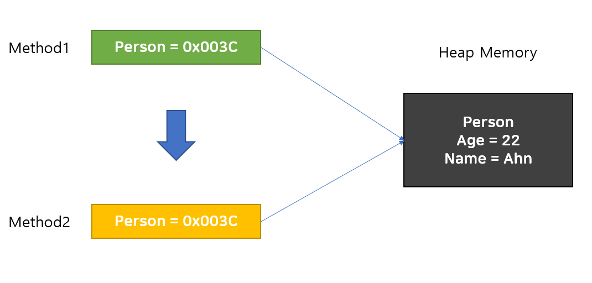
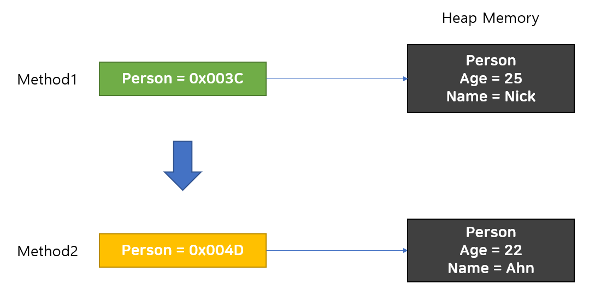

## Java는 Call By Value일까요, Call By Reference 일까요?
#### week4 - 2022-05-02

### Call by Value
- 함수의 인자를 전달할 때 '값을 전달하는 방식'
- 값을 복사하여 넘기는 형태
- 이 방식으로 메소드 호출을 하면 메소드 내에서는 복사된 값으로 작업을 하기 때문에 원래의 값을 변경시키지 않는다.
  
### Call by Reference
- 함수의 인자를 전달할 때 '주소를 전달하는 방식'
- 그 객체를 참조하는 주소를 넘겨주는 형태
- 메소드 내에서도 원래의 값에 접근이 가능하다.
<br>  

## Java는 **Call by Value**

#### 인자 값으로 기본형을 사용했을 때
```java
    public void method1() {
        int a = 10;
        int b = 5;

        System.out.println("Before Call Method2: (a = " + a + ", b = " + b +" )");
        method_2(a, b);
        System.out.println("After Call Method2: (a = " + a + ", b = " + b +" )");

    }

    public void method2(int a, int b) {
        a = 20;
        b = 10;

        System.out.println("Instance Method2: (a = " + a + ", b = " + b +" )");
    }

```

```java
    // Before Call Method2: (a = 10, b = 5)
    // Instance Method2: (a = 20, b = 10)
    // After Call Method2: (a = 10, b = 5)
```

- Java는 Call by value 방식을 수행할 때, 값을 넘겨 받은 메소드에서 값을 복사하여 새로운 지역 변수에 저장함.
- 호출 전과 호출 후의 값이 같음을 알 수 있음

<br>  

#### 인자 값으로 객체를 사용했을 때

```java
    class Person {
        int age;
        String name;
        public Person(int age, String name){
            this.age = age;
            this.name = name;
        }
    }

    public void method1() {
        Person person = new Person(25, "Nick");

        System.out.println("Before Call Method2: (age = " + person.age + ", name = " + person.name +" )");
        method_2(person);
        System.out.println("After Call Method2: (age = " + person.age + ", name = " + person.name +" )");
    }

    public void method2(Person person) {
        person.age = 22;
        person.name = "Ahn";

        System.out.println("Instance Method2: (age = " + person.age + ", name = " + person.name +" )");
    }

```

```java
    // Before Call Method2: (age = 25, name = Nick)
    // Instance Method2: (age = 22, name = Ahn)
    // After Call Method2: (age = 22, name = Ahn)
```


- 객체의 참조값을 직접 바꾼것이 아니라 객체의 참조값을 통해서 그 객체의 멤버변수에 접근하여 그 값을 바꿈.
- 객체를 메소드로 넘길 때 객체를 참조하는 지역변수의 실제 주소를 넘기는 것이 아니라 그 지역변수가 가리키고 있는 힙 영역의 객체를 가리키는 새로운 지역변수를 생성하여 그것을 통하여 같은 객체를 가리키도록 하는 방식!
  



```java
    class Person {
        int age;
        String name;
        public Person(int age, String name){
            this.age = age;
            this.name = name;
        }
    }

    public void method1() {
        Person person = new Person(25, "Nick");

        System.out.println("Before Call Method2: (age = " + person.age + ", name = " + person.name +" )");
        method_2(person);
        System.out.println("After Call Method2: (age = " + person.age + ", name = " + person.name +" )");
    }

    public void method2(Person person) {
        person = new Person(22, "Ahn");
        System.out.println("Instance Method2: (age = " + person.age + ", name = " + person.name +" )");
    }

```

```java
    // Before Call Method2: (age = 25, name = Nick)
    // Instance Method2: (age = 22, name = Ahn)
    // After Call Method2: (age = 25, name = Nick)
```
- 따라서 위의 예시와 같이 method2dptj Person 인스턴스를 생성하여 person에 할당하면, 전달 받은 person 객체에는 영향이 미치지 않는 것이다.




---
참고사이트  
[[Java]Call by value & Call by reference](https://hyoje420.tistory.com/6)  
[[Java] Call by Value, Call by Reference](https://velog.io/@ahnick/Java-Call-by-Value-Call-by-Reference)