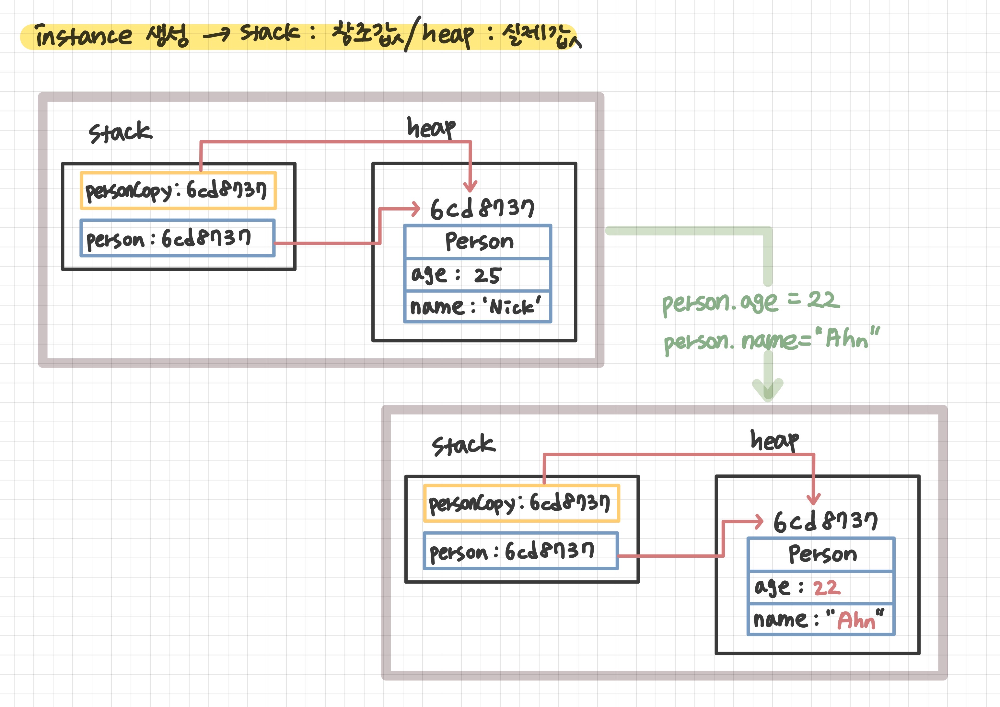
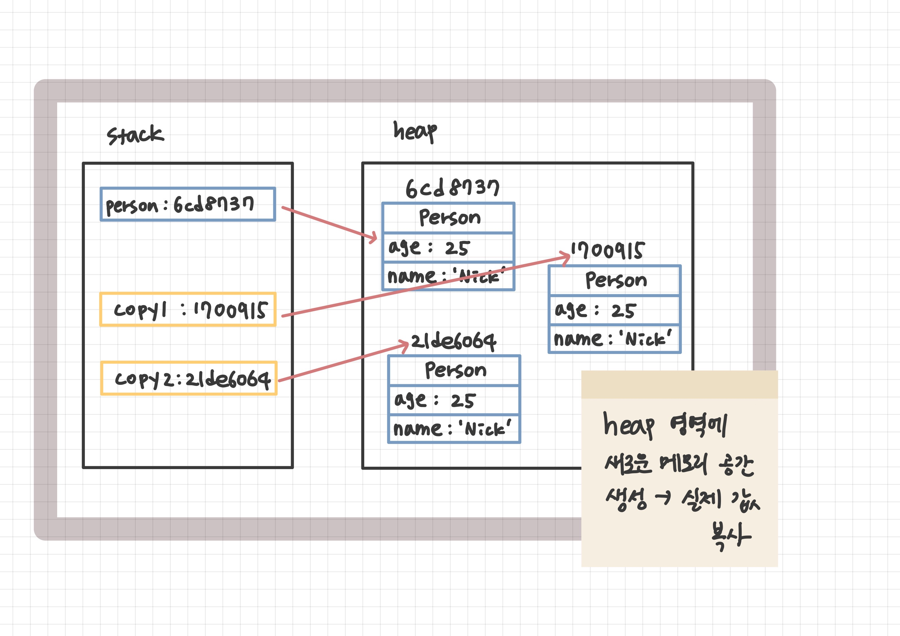

## Shallow Copy와 Deep Copy의 차이는 무엇인가요? 자바에서 Deep Copy를 하기 위해서는 무엇을 사용하여야 하나요?
#### week5 - 2022-05-09

### Shallow copy(얕은 복사) 
> "주소값"을 복사(참조하고 있는 실제 값은 같음)
<br>

- 인스턴스를 생성하게 되면 stack 영역에는 참조값이, heap 영역에는 실제 값이 올라간다.
- 얕은 복사를 하게 되면 heap에 따로 값을 할당 받는게 아니라, original 인스턴스의 참조값을 저장한다. original의 값을 같이 참조하고 있는 것이다.
- 따라서 original의 값을 수정하게 되면, 복사한 인스턴스의 값도 변하게 된다.



### Deep copy(깊은 복사)
> "실제값"을 새로운 메모리 공간에 복사(실제값이 다름)

방법 세 가지
1. 복사 생성자 / 복사 팩터리
2. 직접 객체 생성
3. Clonable을 구현하여 `clone()`재정의 -> final 인스턴스 혹은 배열을 제외하고는 권장x


#### 복사 생성자 / 복사 팩터리

```java
    public class Person {
        int age;
        String name;

        public Person(int age, String name){
            this.age = age;
            this.name = name;
        }

        /* 복사 생성자 */
        public Person(Person original) {
            this.age = original.age;
            this.name = original.name;
        }

        /* 복사 팩터리 */
        public static Person copy(Person original) {
            Person copy = new Person();
            copy.age = original.age;
            copy.name = original.name;
            return copy;
        }

    }
```



#### 직접 객체 생성
```java
    void deepCopy(){
        Person person = new Person(25, "Nick");
        Person copy = new Person();
        copy.setAge(person.getAge());
        copy.setName(person.getName());

        person.setAge(22);
        person.setName("Ahn");

    }

```

#### Clonable을 구현하여 `clone()`재정의

```java
    public class Person implements Cloneable{
        int age;
        String name;

        public Person(int age, String name){
            this.age = age;
            this.name = name;
        }

        @Override
        protected Person clone() throws CloneNotSupportedException {
            return (Person) super.clone();
        }
    }
```

- 복제 기능은 생성자와 팩터리를 이용하는게 최고
- 단, 배열만은 clone 메소드 방식이 가장 깔끔한, 위의 규칙의 합당한 예외라 할 수 있다.

---
참고사이트  
[[Java] - 깊은 복사(Deep Copy) vs 얕은 복사(Shallow Copy)](https://zzang9ha.tistory.com/372)
[[Java] - Shallow copy(얕은복사) vs Deep copy(깊은복사)](https://jackjeong.tistory.com/100)
