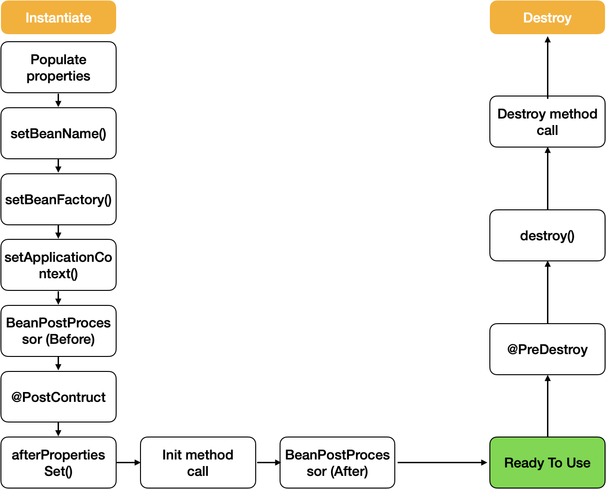
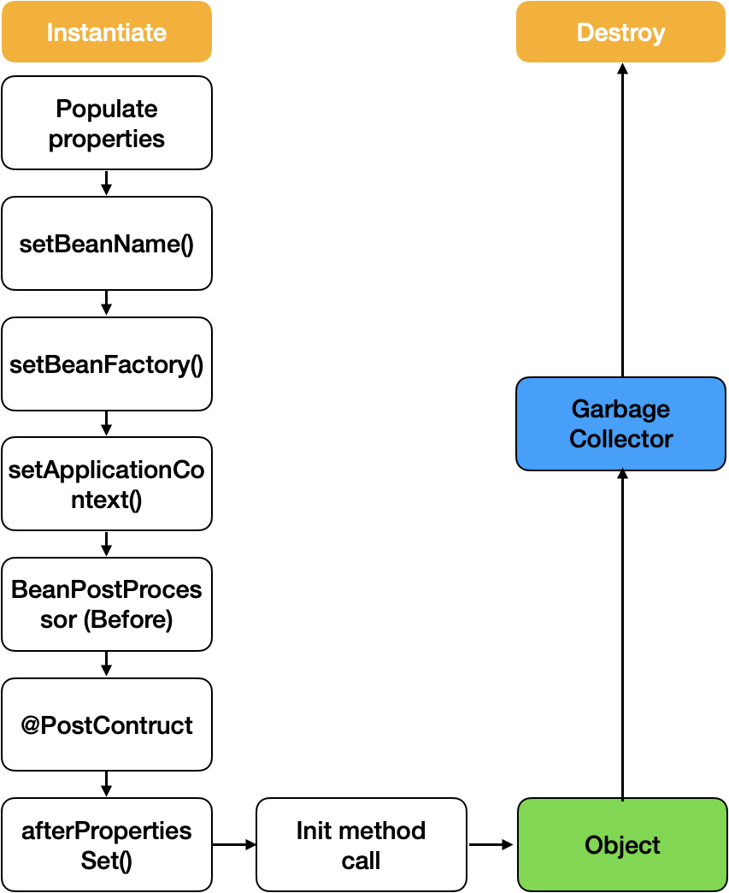

## Spring Bean Life-cycle에 대해서 말해주세요.
#### week5 - 2022-05-09

### Singleton Bean
- Spring IoC container에서 오로지 하나의 객체만 존재
- 컨테이너의 생성 및 소멸 시점과 함께 빈이 생성되고 소멸된다.

```
스프링 컨테이너 생성 -> 스프링 빈/객체 생성 -> 의존관계 주입 -> 초기화 콜백 -> 사용 -> 소멸 전 콜백 -> 스프링 종료
```

- 초기화 콜백 : 개발자가 의존관계 주입이 완료된 상태임을 확인할 수 있으며, 초기화 작업을 진행해야 함을 알 수 있다.
- 소멸 전 콜백 : 스프링이 종료되기 전인 상태임을 개발자가 확인할 수 있으며, 이 때 종료작업을 안전하게 진행할 수 있다.
  
#### 스프링의 빈 생명주기 콜백 지원 방법
1. 인터페이스(InitializingBean, DisposableBean)
2. 초기화 메소드, 종료 메소드 지정
3. `@PostConstruct`, `@PreDestroy` 어노테이션 지정 -> **최신 스프링에서 가장 권장하는 방법**
   - 객체 초기화 함수에 @PostConstruct 어노테이션을, 종료함수에 @PreDestroy 어노테이션을 붙여주면 된다. 
   - 해당 어노테이션들을 붙이면 자동으로 객체 초기화, 종료 시점에 메소드를 호출해준다.

<br>




### Prototype bean
- DI 요청이 있을때마다 새로운 객체가 생성되어 Spring IoC container에서 여러개의 객체가 존재 할 수 있다.
- Spring IoC container는 prototype-bean의 경우 bean생성의 과정 이후 소멸의 과정에는 관여를 하지 않는다.
- Bean 생성 이후에 객체의 소멸의 과정은 Garbage Collector에 의해서 처리된다.
- Prototype Bean에 해당 객체가 DB Connection pool 과 같은 자원을 들고 있는 경우라면 해당 prototype-bean은 GC에의해 소멸되지 않을 것이다. 따라서 custom bean post-processor를 구현하여 객체의 소멸을 직접적으로 관리 할 수 있다.

- 만약 Singleton Bean(A)에서 Prototype bean(B)을 DI 받아 사용한다면 해당 B는 A가 생성될때 함께 한번 생성되고, A가 소멸될때 B또한 소멸 될 수 있다.

<br>




---

참고사이트  
[Scope에 따른 Spring bean life-cycle](https://taes-k.github.io/2020/06/14/spring-bean-scope-lifecycle/)  
[[Spring] Bean LifeCycle이란 무엇일까?](https://devlog-wjdrbs96.tistory.com/321)  
[[Spring] 빈 생명주기 콜백과 객체의 초기화](https://kth990303.tistory.com/26)
[[Spring] 스프링이 빈 생명주기 콜백을 해주는 방법](https://kth990303.tistory.com/29?category=836934)