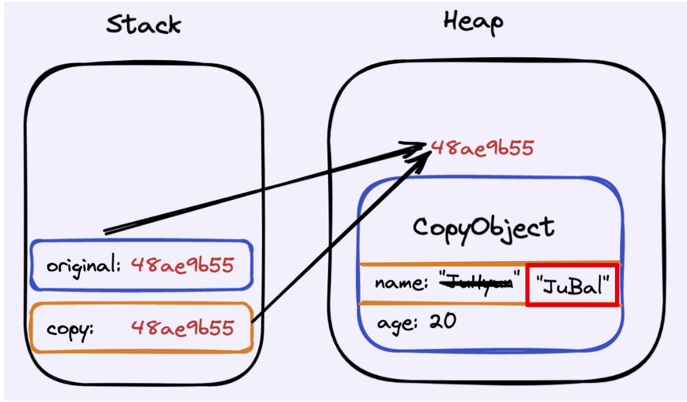
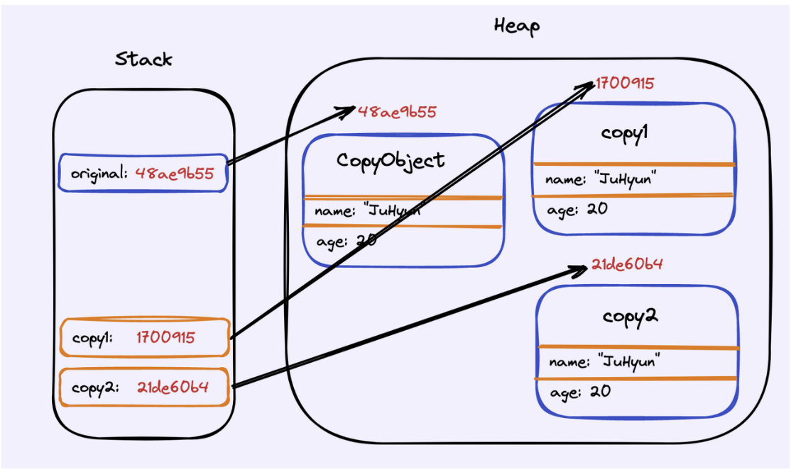

# [Tech Interview]

Shallow Copy와 Deep Copy의 차이는 무엇인가요? 자바에서 Deep Copy를 하기 위해서는 무엇을 사용하여야 하나요?

  

---

## Shallow Copy

'주소 값' 복사

객체를 복사할 때, 객체가 가지고 있는 필드의 값들을 단순히 복사합니다.

기본형(primitive type) 값들은 복사가 될 것이고, 참조형 변수는 같은 객체를 가리키게 됩니다.

그러므로 copy의 name만 변경하더라도 동일한 주소를 참조하고 있기 때문에, original 객체에도 영향을 미칩니다.

## Deep Copy

'실제 값' 복사

객체를 복사할 때, 객체가 가지고 있는 필드의 값을 복사해줍니다. 

이 떄, 기본형 값들은 그대로 복사가 되며, 참조형 변수의 경우 변수가 참조하는 객체에 대해서도 새롭게 복사해서 만들어줍니다.

그러므로 얕은 복사와는 달리, original 인스턴스의 값은 변경되지 않습니다.

---

### Deep Copy를 하기 위해서는 무엇을 사용하여야 하나요?

깊은 복사를 구현하는 방법은 여러가지가 있습니다.

- Cloneable 인터페이스 구현
- 복사 생성자
- 복사 팩터리 등등..

#### 1) Object.clone() 을 통해 clone() 메소드를 구현

이를 통해 깊은 복사를 할 수 있지만, 새로운 인터페이스를 만들 때는 절대 Cloneable을 확장해서는 안되며, 
새로운 클래스도 이를 구현해서는 안됩니다.

기본 원칙은 '복제 기능은 **생성자와 팩터리**를 이용하는게 최고' 라는 것입니다.
단, 배열의 경우에는 clone 메소드 방식을 통해 깔끔하게 복제할 수 있습니다.

#### 2) 복사 생성자, 복사 팩터리

copy() 메소드를 통해서 복사합니다.

