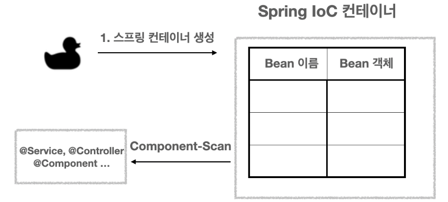
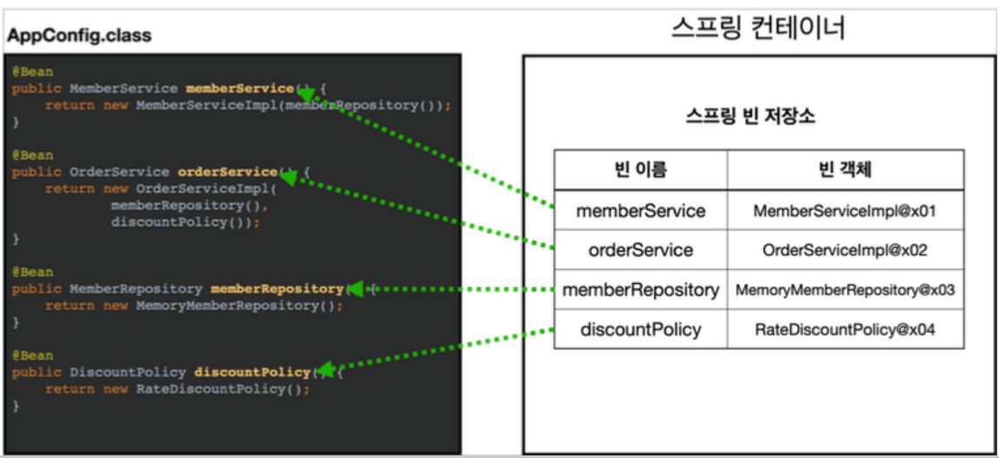
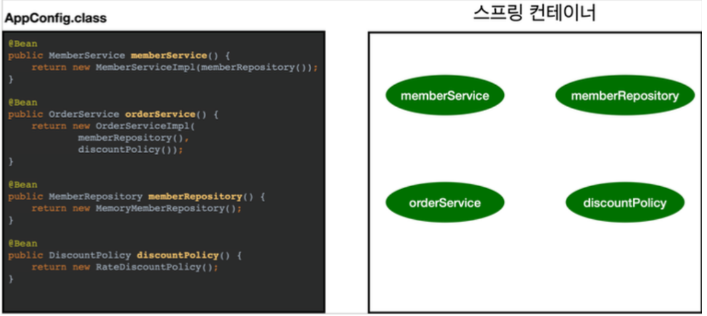
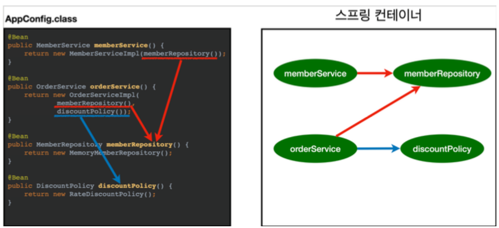

# [Tech Interview]

Spring Bean Life-cycle에 대해서 말해주세요.

<br>

---

## Bean LifeCycle

스프링의 Bean LifeCycle을 보면 아래와 같습니다.

```text
스프링 컨테이너 생성 -> 스프링 빈 생성 -> 의존관계 주입 -> 초기화 콜백 -> 사용 -> 소멸 전 콜백 -> 스프링 종료
```


스프링 빈도 초기화 작업과 종료 작업이 나눠서 진행됩니다. 

간단하게 말하면 객체 생성 -> 의존관계 주입이라는 라이프사이클을 가집니다.


### Spring 의존관계 주입 과정

1. Spring IOC 컨테이너가 만들어집니다.
    
    <br>
    
   
    
<br>
    
2. 그리고 @Configuration, @Controller, @Service 등등 Bean 으로 등록할 수 있는 어노테이션들과 설정파일들을 읽어 
IoC 컨테이너 안에 Bean 으로 등록을 시킵니다.
    
    <br>
    
   
    
<br>

3. 그리고 의존 관계를 주입하기 전의 준비 단계가 존재합니다. 이 단계에서 객체의 생성이 일어납니다. 여기서 한가지 알고 넘어가야 할 부분이 있습니다.
   
    <br>
       - 생성자 주입: 객체의 생성, 의존관계 주입이 동시에 일어남
    <br>
       - setter, Field 주입: 객체의 생성 -> 의존관계 주입으로 라이프 사이클이 나누어져 있음

           
    
  

4. 위와 같이 코드에 작성한 의존관계를 보고 IoC 컨테이너에서 의존성 주입을 해줍니다.
    
    


---

### 스프링 의존관계 주입이 완료된 시점을 개발자가 어떻게 알 수 있을까?

스프링은 의존관계 주입이 완료되면 스프링 빈에게 콜백 메소드를 통해서 초기화 시점을 알려주는 다양한 기능을 제공합니다. 또한 스프링은 스프링 컨테이너가 종료되기 직전에 소멸 콜백을 제공합니다.

초기화 콜백: 빈이 생성되고, 빈의 의존관계 주입이 완료된 후 호출
소멸전 콜백: 빈이 소멸되기 직전에 호출